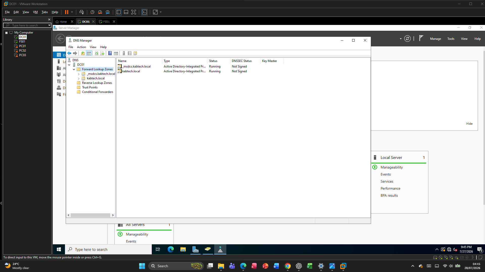
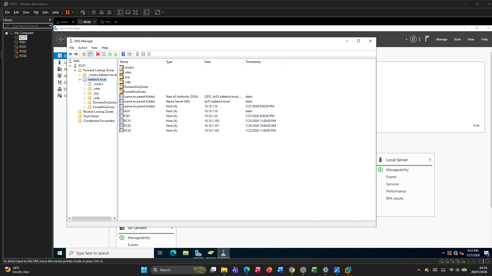
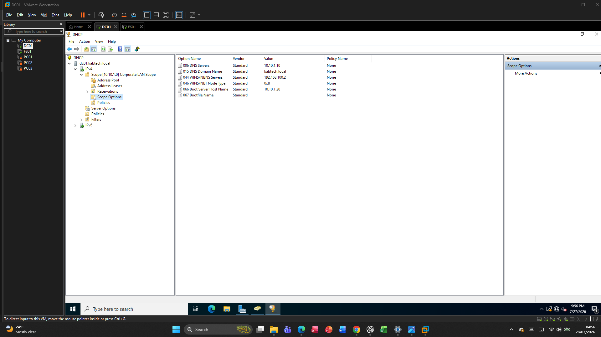
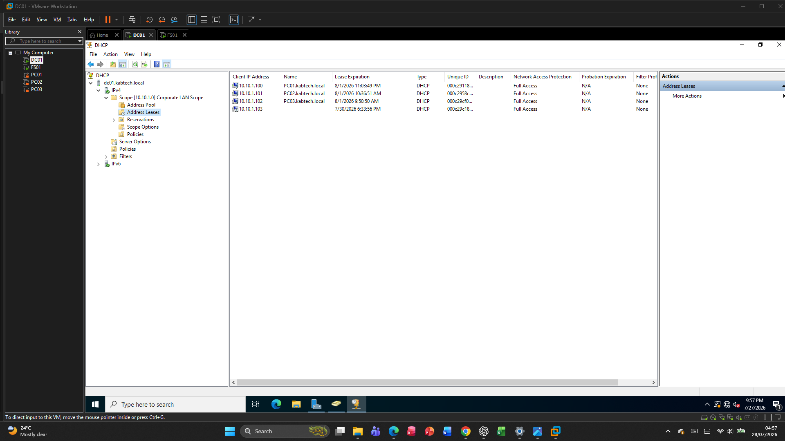
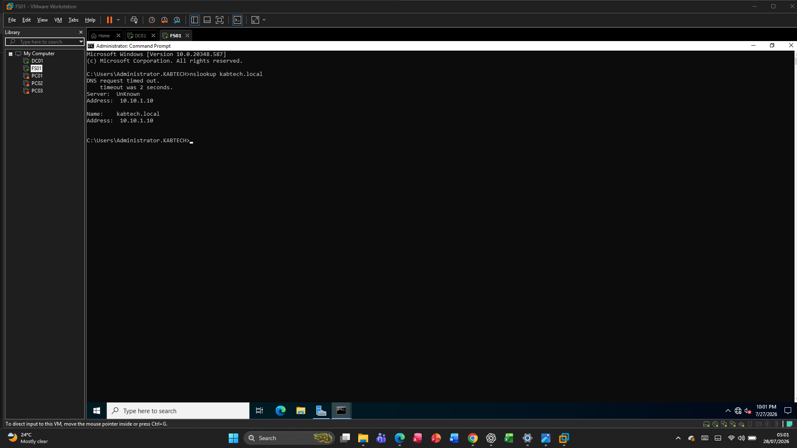
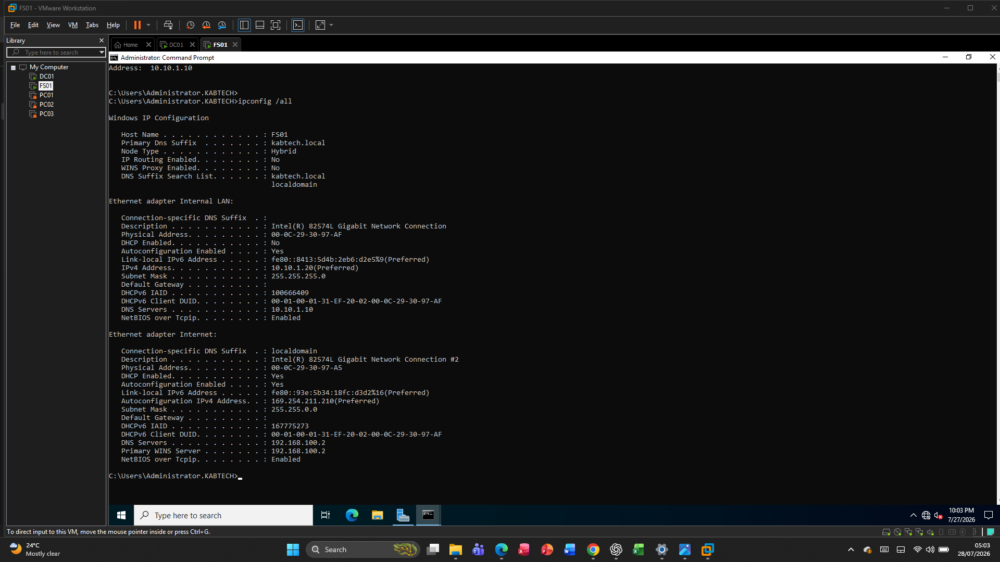

# DNS and DHCP Configuration

## Overview

The Windows Server 2022 Enterprise IT Lab uses Microsoft DNS and DHCP to provide centralized name resolution and automatic IP address assignment for all domain-joined computers. Both services are hosted on the Domain Controller (DC01), allowing client computers to automatically locate Active Directory resources and communicate across the network.

---

# DNS Configuration

## Purpose

The Domain Name System (DNS) translates hostnames into IP addresses, enabling users and computers to locate network resources without needing to remember IP addresses.

Active Directory depends on DNS for authentication, domain joining, Group Policy processing, and locating domain controllers.

---

## DNS Server Information

| Setting | Value |
|---------|-------|
| DNS Server | DC01 |
| IP Address | 10.10.1.10 |
| Zone Type | Active Directory Integrated |
| Forward Lookup Zone | kabtech.local |

---

## DNS Records

The following host records were created.

| Host | IP Address |
|------|------------|
| dc01 | 10.10.1.10 |
| fs01 | 10.10.1.20 |

These records allow client computers to locate the Domain Controller and File Server using hostnames instead of IP addresses.

---

## DNS Verification

The following commands were used to verify DNS functionality.

```powershell
nslookup dc01.kabtech.local

ping dc01.kabtech.local
```

Successful responses confirmed that the DNS server correctly resolved hostnames within the domain.

---

# DHCP Configuration

## Purpose

The Dynamic Host Configuration Protocol (DHCP) automatically assigns IP addresses and network settings to client computers. This removes the need to manually configure networking on each workstation.

---

## DHCP Server Information

| Setting | Value |
|---------|-------|
| DHCP Server | DC01 |
| Scope Name | Corporate LAN |
| Network | 10.10.1.0/24 |
| Address Pool | 10.10.1.100 – 10.10.1.200 |
| Lease Duration | 8 Days |

---

## DHCP Options

The following DHCP options were configured.

| Option | Value |
|--------|-------|
| DNS Server | 10.10.1.10 |
| DNS Domain | kabtech.local |

These options ensure that all client computers receive the correct DNS configuration automatically.

---

# Client Configuration

Client computers were configured to obtain their network settings automatically.

After renewing their DHCP leases, each client received:

- IP address
- Subnet mask
- DNS server
- DNS suffix
- DHCP lease information

---

# DHCP Validation

The following commands were used to verify DHCP operation.

```powershell
ipconfig /release

ipconfig /renew

ipconfig /all
```

The output confirmed that the clients received addresses from the configured DHCP scope.

---

# DNS Validation

The following tests confirmed successful DNS resolution.

```powershell
nslookup dc01.kabtech.local

ping dc01.kabtech.local
```

Results showed that:

- Domain names resolved successfully.
- The Domain Controller responded to DNS queries.
- Clients could communicate with domain resources.

---

# Troubleshooting

## Issue 1 – VMware DHCP Assigned Addresses

### Problem

Initially, client computers received IP addresses from VMware's DHCP service instead of the Windows DHCP server.

### Cause

The virtual machines were connected to the wrong virtual network.

### Resolution

- Created an isolated VMnet2 network.
- Connected DC01, FS01, and all client computers to VMnet2.
- Renewed DHCP leases.

Result:

Clients received IP addresses from the Windows DHCP server.

---

## Issue 2 – Incorrect DNS Server

### Problem

Client computers used the VMware DNS server instead of the internal DNS server.

### Cause

DHCP Option 006 was configured with an incorrect DNS server address.

### Resolution

Updated DHCP Option 006 to use:

```
10.10.1.10
```

Clients renewed their leases and began using the correct DNS server.

---

## Issue 3 – Duplicate DNS Records

### Problem

The Domain Controller registered both its internal and NAT IP addresses in DNS.

### Cause

The Domain Controller had two active network adapters, and both addresses were dynamically registered.

### Resolution

Removed the obsolete NAT DNS record, leaving only:

```
dc01.kabtech.local → 10.10.1.10
```

This ensured reliable name resolution for domain clients.

---

## Issue 4 – Client DNS Resolution Failure

### Problem

One client failed to resolve domain names even though it could ping the Domain Controller.

### Cause

The client queried the VMware DNS server instead of the internal DNS server.

### Resolution

Released and renewed the DHCP lease after correcting the DHCP DNS option. The client then successfully resolved domain names.

---

# Results

At the completion of the DNS and DHCP deployment:

- DNS resolved all domain resources correctly.
- DHCP automatically assigned IP addresses.
- Clients received the correct DNS server.
- Domain authentication functioned normally.
- Hostname resolution was reliable across the environment.
- Active Directory communication operated successfully.

---

# Summary

DNS and DHCP provide the networking foundation of the Windows Server 2022 Enterprise IT Lab. DNS enables reliable name resolution for Active Directory and other services, while DHCP automates IP address assignment and client configuration. Together, these services simplify network administration, reduce configuration errors, and support centralized management across the enterprise.


# Screenshots

## DNS Forward Lookup Zone



---

## DNS Host Records



---

## DHCP Scope


---

## DHCP Scope Options



---

## Active DHCP Leases



---

## DNS Verification



---

## DHCP Verification


