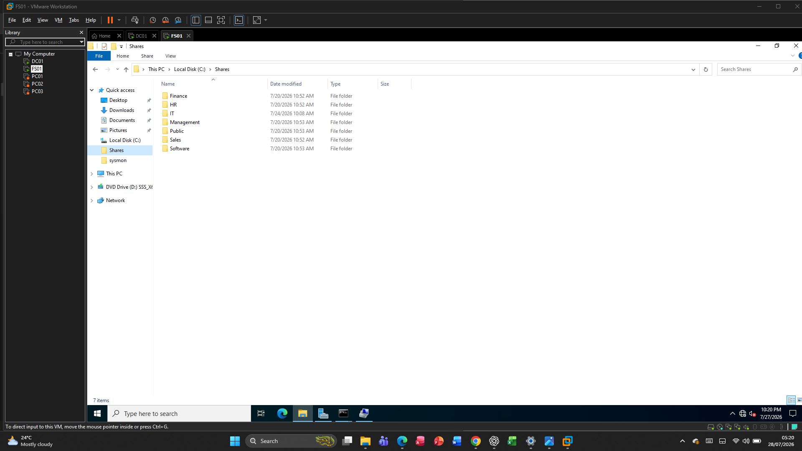
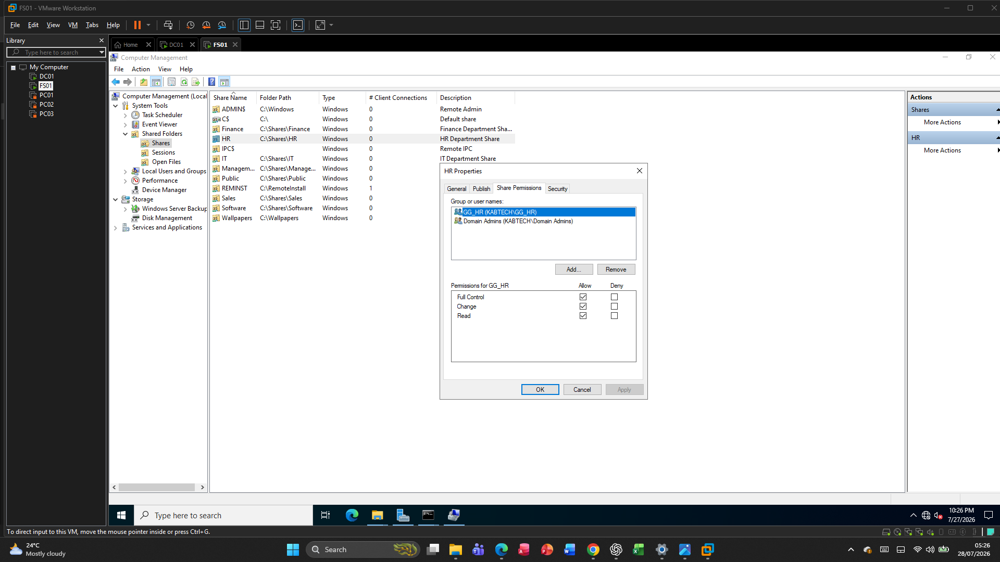
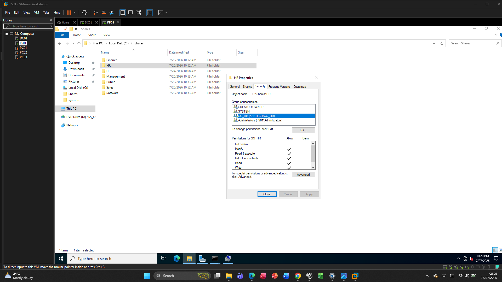
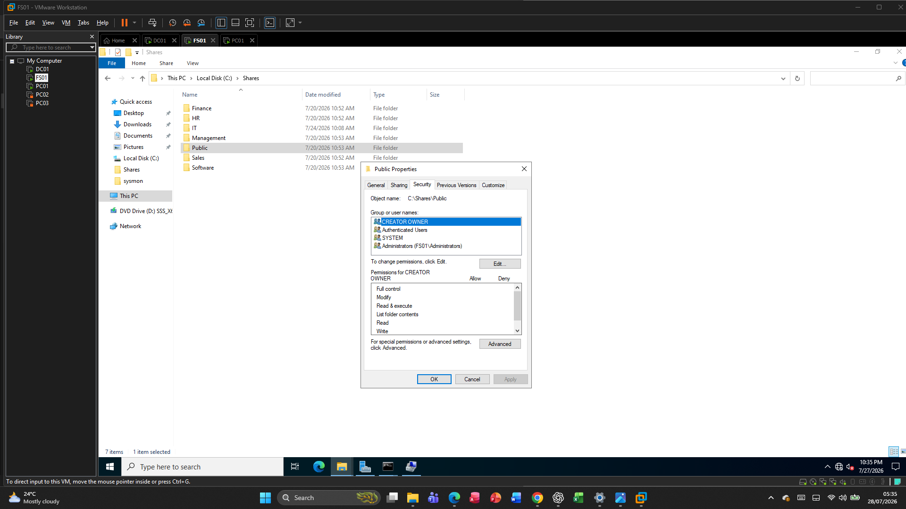
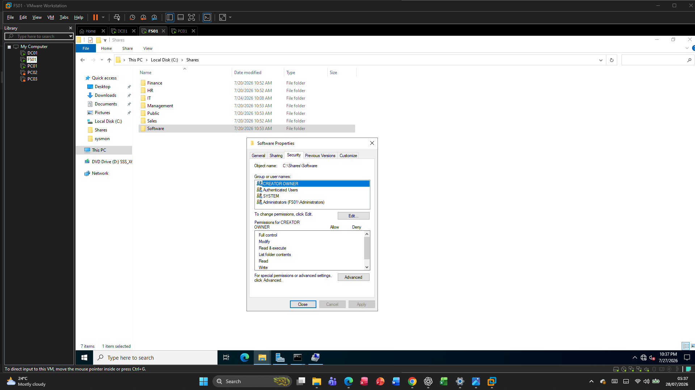
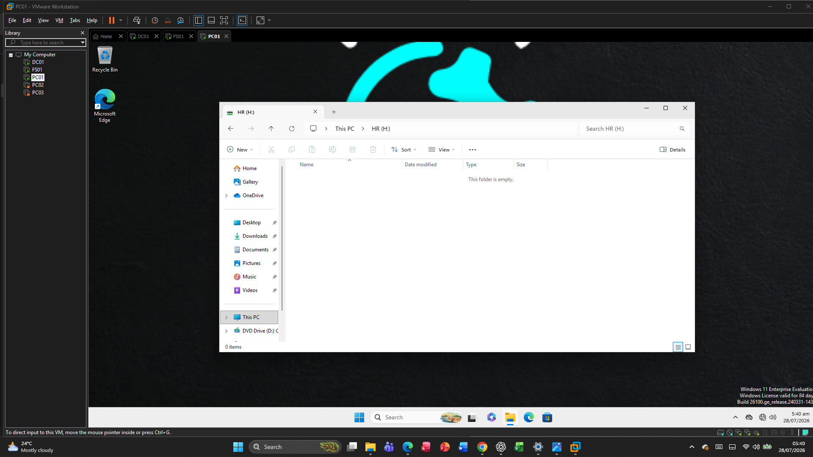

# File Server

## Overview

The File Server (FS01) provides centralized file storage and secure resource sharing for the KabTech enterprise environment. Departmental shared folders were created to allow users to securely access files based on their Active Directory group membership.

Access to each shared folder is controlled using a combination of NTFS permissions, Share permissions, and Active Directory security groups, following Microsoft's recommended best practices.

---

# File Server Information

| Setting | Value |
|---------|-------|
| Server Name | FS01 |
| Operating System | Windows Server 2022 Standard |
| Role | File Server |
| File Sharing Protocol | SMB (Server Message Block) |

---

# Shared Folder Structure

The following shared folders were created on FS01.

| Shared Folder | Purpose |
|--------------|---------|
| HR | Human Resources documents |
| Finance | Finance department documents |
| IT | IT department resources |
| Sales | Sales department documents |
| Management | Management documents |
| Public | Shared company files |
| Software | Software repository |

These folders provide centralized storage while restricting access based on department.

---

# Share Permissions

Share permissions determine who can access a shared folder over the network.

| Share | Authenticated Users | Domain Admins |
|--------|---------------------|---------------|
| HR | Change | Full Control |
| Finance | Change | Full Control |
| IT | Change | Full Control |
| Sales | Change | Full Control |
| Management | Change | Full Control |
| Public | Change | Full Control |
| Software | Read | Full Control |

The **Software** share is configured as read-only to prevent users from modifying installation files.

---

# NTFS Permissions

NTFS permissions provide more granular control over access to files and folders.

Each departmental folder grants **Modify** access only to the corresponding departmental security group.

Example:

| Folder | Group | Permission |
|--------|-------|------------|
| HR | HR | Modify |
| Finance | Finance | Modify |
| IT | IT | Modify |
| Sales | Sales | Modify |
| Management | Management | Modify |

Domain Admins retain Full Control over all folders.

---

# Access Control Model

The file server follows Microsoft's recommended access model:

```
Users
      ↓
Security Groups
      ↓
NTFS Permissions
      ↓
Shared Folder
```

Instead of assigning permissions directly to users, permissions are assigned to security groups. This simplifies administration and improves scalability.

---

# Public Share

The Public share is available to all authenticated users.

Purpose:

- Company announcements
- Shared templates
- General documentation
- Collaboration files

Permissions:

| Group | Permission |
|--------|------------|
| Authenticated Users | Change |
| Domain Admins | Full Control |

---

# Software Repository

The Software share stores approved software packages for installation.

Purpose:

- Application installers
- Utility software
- Drivers
- Internal deployment packages

Permissions:

| Group | Permission |
|--------|------------|
| Authenticated Users | Read |
| Domain Admins | Full Control |

This configuration prevents accidental modification of installation files.

---

# Drive Mapping

Departmental network drives are automatically mapped using Group Policy Preferences.

When users log on:

- HR users receive the HR network drive.
- Finance users receive the Finance drive.
- IT users receive the IT drive.
- Sales users receive the Sales drive.
- Management users receive the Management drive.

This provides seamless access to departmental resources without requiring manual configuration.

---

# Validation

The following tests were completed successfully.

## File Access

Verified that users could:

- Open departmental folders.
- Create files.
- Modify files.
- Delete files (where permitted).

---

## Permission Testing

Verified that:

- HR users could not access Finance folders.
- Finance users could not access HR folders.
- Public folder was accessible to all authenticated users.
- Software repository allowed read-only access.
- Domain Admins had Full Control over all shares.

---

## Drive Mapping

Logged in using departmental user accounts.

Confirmed that:

- The correct network drive was automatically mapped.
- Unauthorized departmental shares were not visible.
- Users could access only the resources assigned to their department.

---

# Benefits

Implementing centralized file services provides several advantages.

- Centralized storage
- Improved collaboration
- Simplified backups
- Easier permission management
- Better security
- Reduced administrative overhead
- Scalable access control

---

# Summary

The File Server provides centralized and secure file storage for the KabTech enterprise environment. By combining SMB shares, NTFS permissions, Active Directory security groups, and automatic drive mapping through Group Policy, the solution ensures users have access only to the resources required for their roles while maintaining a scalable and manageable file-sharing infrastructure.

# Screenshots

## Shared Folders



---

## Share Permissions



---

## NTFS Permissions



---

## Public Share



---

## Software Share



---

## Mapped Network Drive


---

## HR User Access


