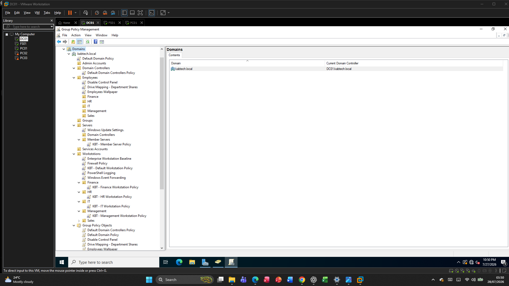
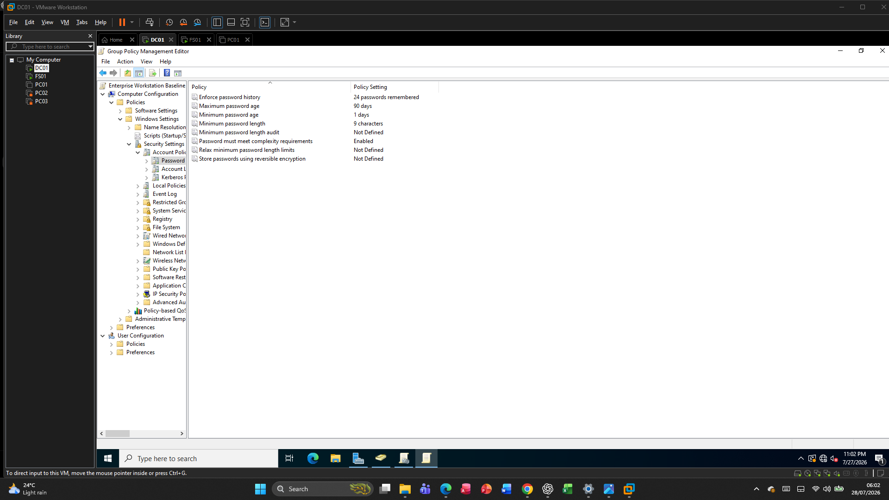
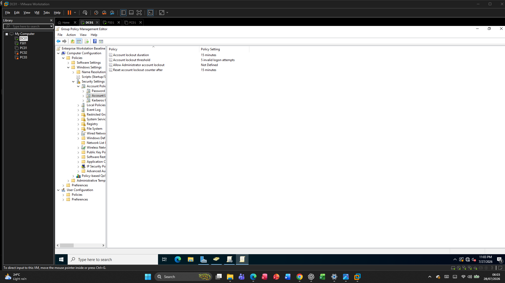
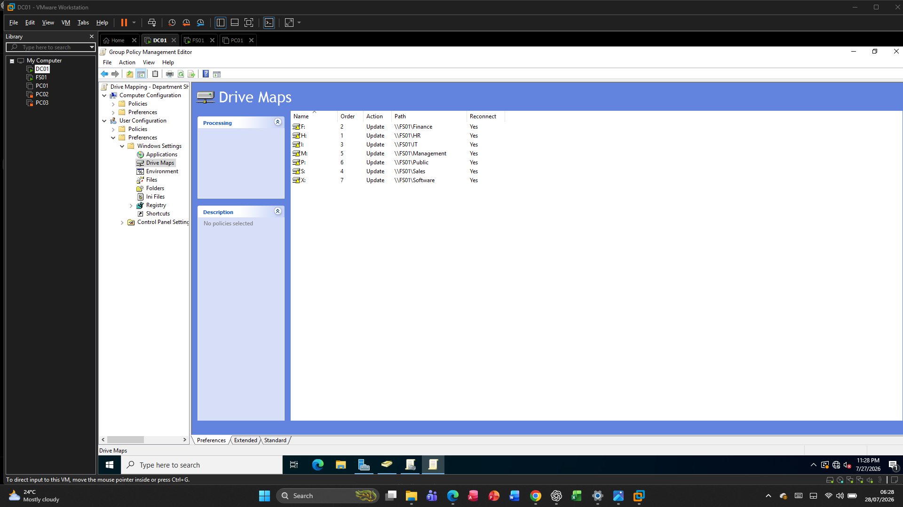
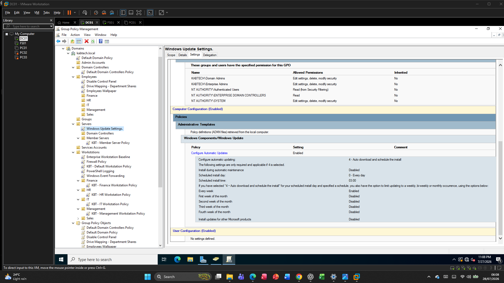
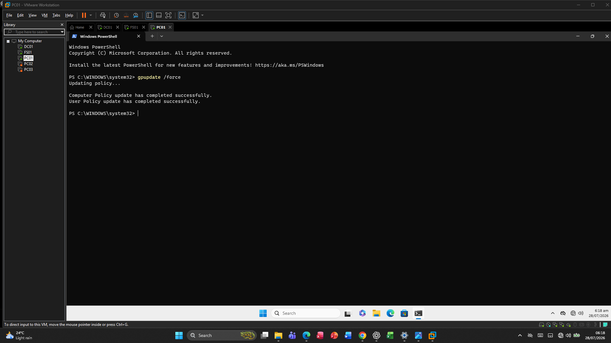
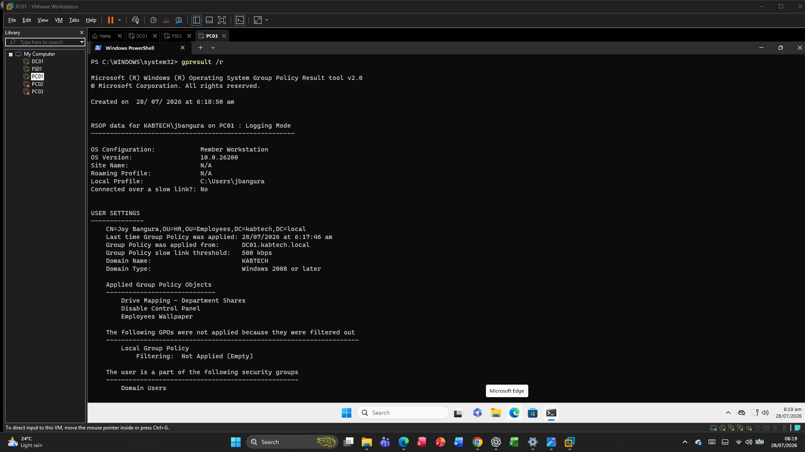
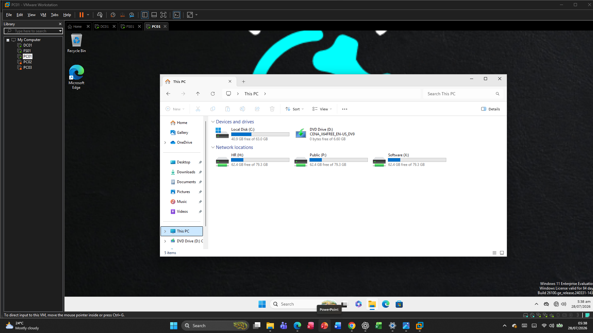

# Group Policy

## Overview

Group Policy is a feature of Microsoft Active Directory that enables administrators to centrally manage and configure computers and user accounts across the domain. In this lab, several Group Policy Objects (GPOs) were created to automate administrative tasks, improve security, and standardise workstation configurations.

The policies were linked to the appropriate Organizational Units (OUs) to ensure they applied only to the intended users or computers.

---

# Group Policy Infrastructure

| Setting | Value |
|---------|-------|
| Domain | kabtech.local |
| Domain Controller | DC01 |
| Group Policy Management | Group Policy Management Console (GPMC) |
| Operating System | Windows Server 2022 |

---

# Group Policies Implemented

The following Group Policy Objects were created and configured.

| Policy | Purpose |
|---------|---------|
| Password Policy | Enforce secure passwords |
| Account Lockout Policy | Protect against brute-force attacks |
| Automatic Drive Mapping | Map departmental network drives |
| Windows Update Policy | Configure Windows Updates |
| Desktop Restrictions | Standardise the user desktop |
| Control Panel Restrictions *(optional)* | Prevent unauthorised configuration changes |

---

# Password Policy

A domain-wide password policy was configured to improve account security.

## Configuration

| Setting | Value |
|---------|-------|
| Password History | 24 passwords |
| Minimum Password Length | 8 characters |
| Maximum Password Age | 90 days |
| Minimum Password Age | 1 day |
| Password Complexity | Enabled |

These settings encourage strong password practices and reduce the likelihood of password reuse.

---

# Account Lockout Policy

An account lockout policy was configured to protect user accounts from password guessing attacks.

## Configuration

| Setting | Value |
|---------|-------|
| Lockout Threshold | 5 invalid attempts |
| Lockout Duration | 15 minutes |
| Reset Counter After | 15 minutes |

This policy automatically locks an account after repeated failed logon attempts.

---

# Automatic Drive Mapping

Departmental network drives were automatically mapped using Group Policy Preferences.

## Mapped Drives

| Department | Network Path |
|------------|--------------|
| HR | `\\FS01\HR` |
| Finance | `\\FS01\Finance` |
| IT | `\\FS01\IT` |
| Sales | `\\FS01\Sales` |
| Management | `\\FS01\Management` |

Drive mapping was configured using Item-Level Targeting so that users only receive the drive assigned to their security group.

---

# Windows Update Policy

A Windows Update policy was applied to domain computers to ensure systems remain secure and up to date.

## Configuration

| Setting | Value |
|---------|-------|
| Configure Automatic Updates | Enabled |
| Update Installation | Automatic |
| Scheduled Install Day | Every Day |
| Scheduled Install Time | 03:00 |

This policy provides a consistent update strategy across the organisation.

---

# Desktop Restrictions

User desktop settings were managed through Group Policy to maintain a consistent environment.

Examples include:

- Standard desktop configuration
- Consistent user experience
- Centralised desktop management

---

# Group Policy Processing

Group Policy is processed in the following order:

1. Local Policy
2. Site
3. Domain
4. Organizational Unit (OU)

This ensures that organisational policies override local settings where appropriate.

---

# Validation

The following tests confirmed successful policy deployment.

## Group Policy Update

The following command was executed:

```powershell
gpupdate /force
```

The update completed successfully.

---

## Group Policy Results

The following command was used to verify applied policies.

```powershell
gpresult /r
```

The output confirmed that the correct GPOs were applied to both users and computers.

---

## Drive Mapping Validation

Logged in with users from different departments.

Confirmed that:

- Departmental network drives appeared automatically.
- Users only received the drives assigned to their department.
- Unauthorised drives were not mapped.

---

## Password Policy Validation

Attempted to create weak passwords.

The domain correctly rejected passwords that did not meet complexity requirements.

---

## Windows Update Validation

Verified that client computers received the configured Windows Update policy through Group Policy.

---

# Benefits

Using Group Policy provides several advantages:

- Centralised administration
- Improved security
- Automated workstation configuration
- Reduced manual effort
- Consistent user experience
- Simplified policy management
- Scalable administration

---

# Summary

Group Policy was used extensively throughout the Windows Server 2022 Enterprise IT Lab to automate configuration, enforce security standards, and simplify system administration. Password policies, account lockout settings, automatic drive mapping, and Windows Update management demonstrate how Group Policy enables efficient and consistent administration across a Windows domain.

# Screenshots

## Group Policy Management Console



---

## Password Policy



---

## Account Lockout Policy



---

## Drive Mapping Policy



---

## Windows Update Policy



---

## Group Policy Update



---

## Group Policy Results



---

## Automatically Mapped HR Drive


