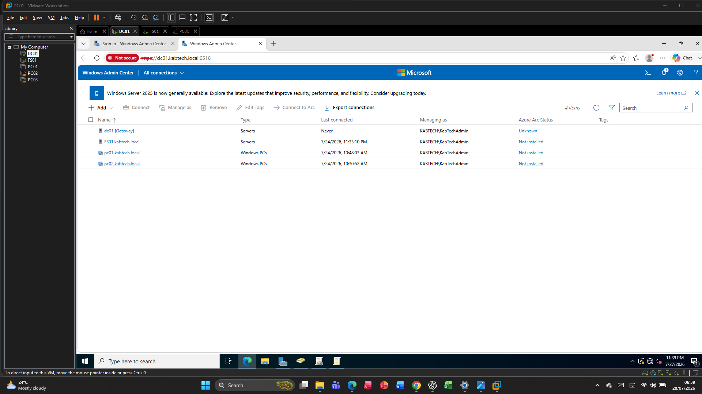
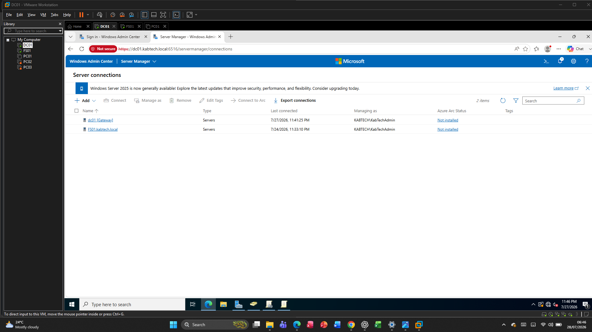
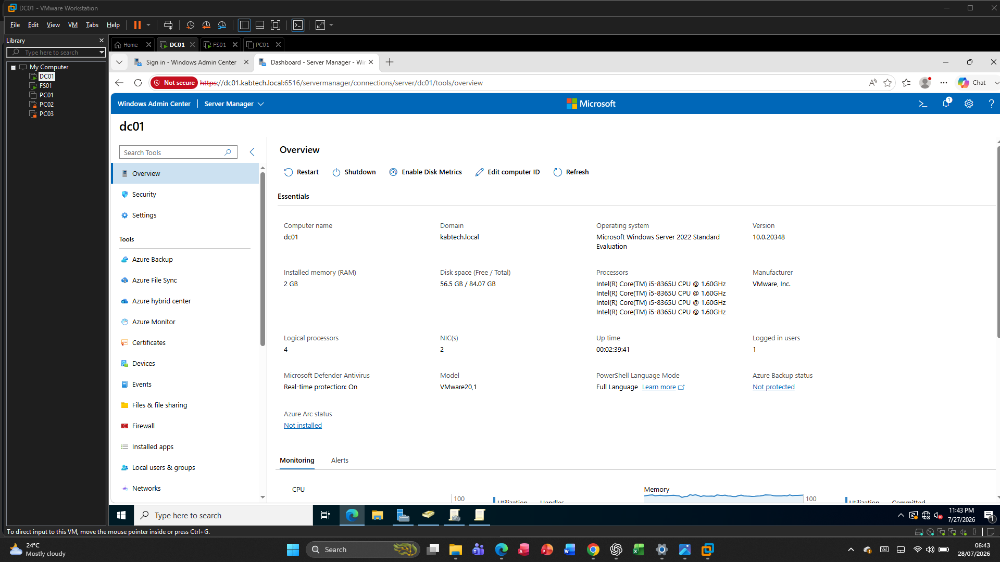
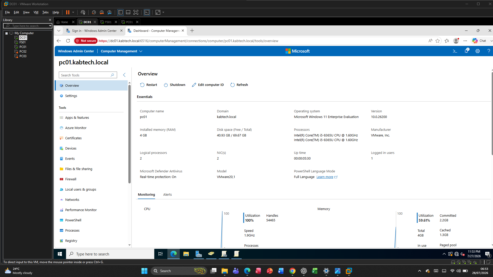
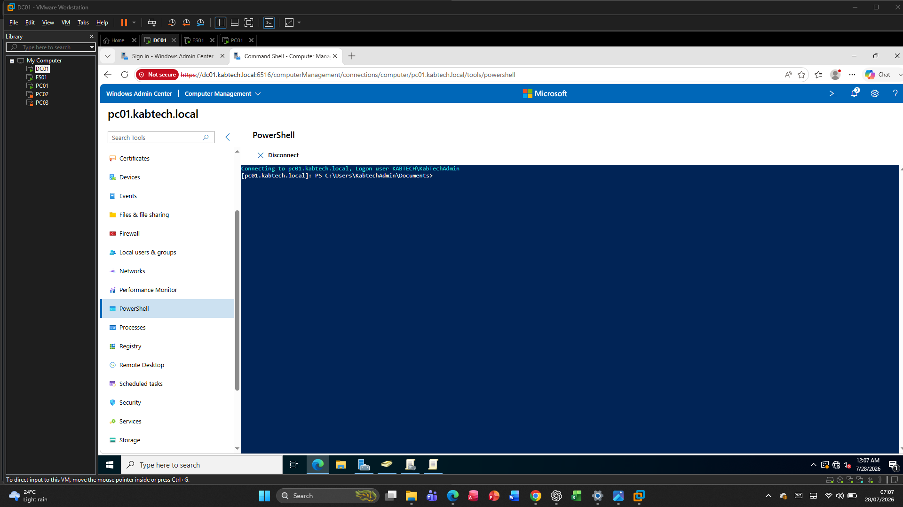
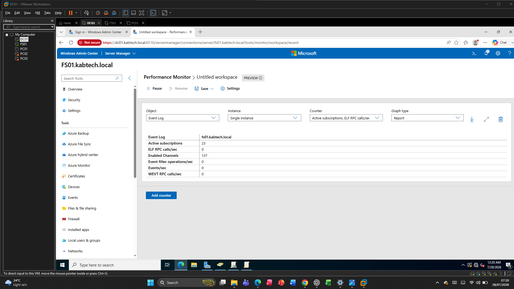
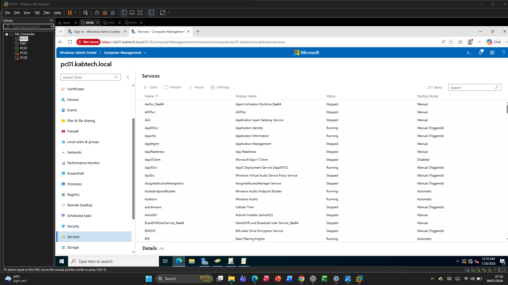

docs/08-Windows-Admin-Center.md

# Windows Admin Center

## Overview

Windows Admin Center (WAC) is Microsoft's browser-based management platform for Windows Servers and Windows client computers. It provides a centralised interface for managing servers, workstations, storage, networking, event logs, performance, PowerShell, and many other administrative tasks.

In this lab, Windows Admin Center was deployed on the domain controller (DC01) to provide a single management interface for the enterprise environment.

---

# Environment

| Setting | Value |
|---------|-------|
| Server | DC01 |
| Operating System | Windows Server 2022 Standard |
| Windows Admin Center Version | 2.x |
| Access Method | HTTPS |
| Default Port | 6516 |

---

# Installation

Windows Admin Center was installed using the Microsoft installer.

The installation included:

- PowerShell Remoting
- WinRM configuration
- HTTPS listener
- Self-signed certificate
- Windows Firewall rule
- Windows Admin Center service

After installation, the web interface was accessible using:

```

https://DC01:6516

```

---

# Managed Devices

The following computers were added to Windows Admin Center.

| Computer | Role |
|----------|------|
| DC01 | Domain Controller |
| FS01 | File Server |
| PC01 | Windows Client |
| PC02 | Windows Client |

Each device was successfully connected using domain administrator credentials.

---

# Features Used

During this project, Windows Admin Center was used to manage the enterprise environment.

## Computer Management

Performed the following tasks:

- View computer information
- Restart computers
- Monitor services
- View installed roles
- Manage local users
- View hardware information

---

## Event Viewer

Reviewed Windows event logs remotely.

Examined:

- System logs
- Application logs
- Security logs

This allows administrators to troubleshoot issues without logging on locally.

---

## PowerShell

Executed PowerShell commands remotely from the browser.

Example:

```powershell
Get-Service
```

Remote PowerShell reduces the need for Remote Desktop sessions.

---

## Performance Monitoring

Used Windows Admin Center to monitor:

- CPU utilisation
- Memory usage
- Disk activity
- Network traffic

This helps identify resource bottlenecks and performance issues.

---

## Services

Viewed and managed Windows services.

Tasks included:

- Start services
- Stop services
- Restart services
- Review service status

---

## Processes

Reviewed running processes to identify:

- High CPU usage
- High memory consumption
- Application activity

---

## Storage

Viewed:

- Disk usage
- Volumes
- File systems
- Available storage capacity

---

## Networking

Reviewed:

- Network adapters
- IP configuration
- DNS settings
- Network utilisation

---

# Security

Windows Admin Center communicates using HTTPS.

The deployment included:

- Secure web interface
- Windows authentication
- PowerShell Remoting
- WinRM
- HTTPS encryption

These features help secure remote administration.

---

# Validation

The following tests confirmed successful deployment.

## Installation

Verified that the Windows Admin Center service was installed and running.

---

## Remote Connections

Successfully connected to:

- DC01
- FS01
- PC01
- PC02

---

## Event Logs

Successfully viewed Windows Event Logs remotely.

---

## PowerShell

Executed PowerShell commands remotely.

---

## Performance

Successfully monitored CPU, RAM, storage and networking for managed devices.

---

# Benefits

Using Windows Admin Center provides several advantages:

- Centralised management
- Browser-based administration
- Secure remote management
- Simplified troubleshooting
- Performance monitoring
- Reduced Remote Desktop usage
- Modern Microsoft management interface

---

# Summary

Windows Admin Center provides a modern, secure, browser-based management platform for Windows infrastructure. By deploying WAC in this lab, multiple servers and client computers can be administered remotely from a single interface, improving operational efficiency and simplifying day-to-day IT administration.


# Screenshots

## Windows Admin Center Dashboard



---

## Managed Computers



---

## DC01 Overview



---

## PC01 Overview



---

## Event Viewer


---

## Remote PowerShell



---

## Performance Monitoring



---

## Services


