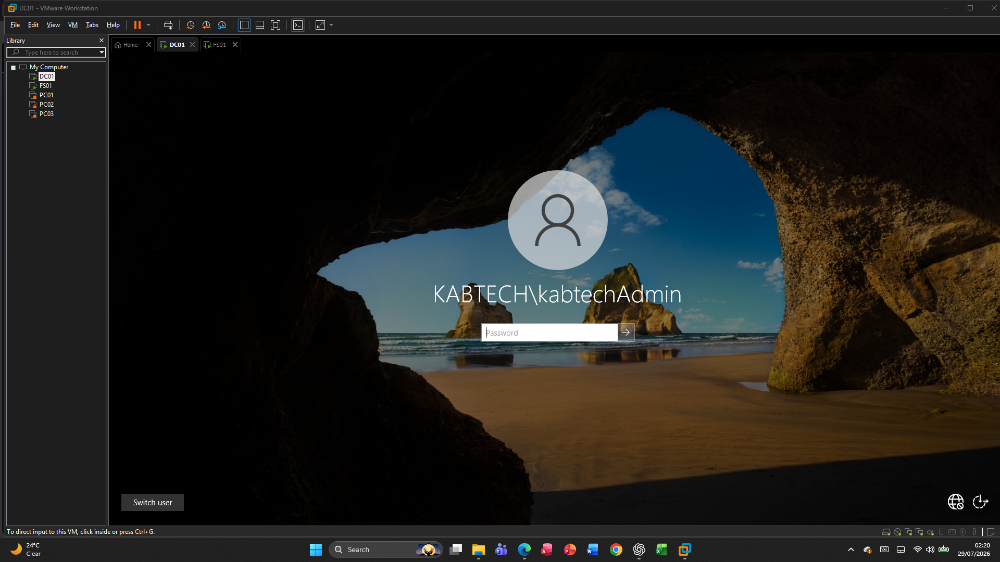

docs/11-Lessons-Learned.md

# Lessons Learned

## Overview

This Windows Server 2022 Enterprise IT Lab provided hands-on experience in designing, deploying, configuring, and managing a small enterprise Windows environment. Throughout the project, I implemented core infrastructure services, resolved real-world technical issues, and gained practical experience with Windows Server administration.

The lab simulated tasks commonly performed by IT Support Specialists and Systems Administrators in an enterprise environment.

---

# Technical Skills Developed

During this project, I developed practical experience in the following areas:

## Windows Server Administration

- Installing Windows Server 2022
- Managing Server Manager
- Installing server roles and features
- Managing Windows services
- Remote server administration

---

## Active Directory

Implemented a complete Active Directory environment, including:

- Domain creation
- Organisational Units (OUs)
- User accounts
- Security groups
- Computer objects
- Group membership
- Account management

---

## DNS

Configured and managed:

- Forward lookup zones
- Host (A) records
- DNS name resolution
- DNS troubleshooting

Learned the importance of correct DNS configuration for Active Directory.

---

## DHCP

Configured a DHCP server to:

- Create IPv4 scopes
- Configure scope options
- Assign IP addresses automatically
- Configure DNS settings
- Manage DHCP leases

---

## File Services

Configured a file server by:

- Creating shared folders
- Setting NTFS permissions
- Applying share permissions
- Mapping network drives
- Managing departmental access

---

## Group Policy

Implemented Group Policy Objects (GPOs) to:

- Configure Windows Update settings
- Map network drives
- Apply desktop restrictions
- Manage organisational policies

---

## Windows Admin Center

Successfully deployed and configured Windows Admin Center to:

- Monitor servers
- Manage clients
- View event logs
- Run PowerShell remotely
- Monitor system performance

---

## System Monitoring

Used built-in Windows tools to monitor system health, including:

- Task Manager
- Resource Monitor
- Performance Monitor
- Reliability Monitor
- Event Viewer
- Windows Services

---

# Troubleshooting Experience

One of the most valuable aspects of this lab was troubleshooting real configuration issues.

Problems resolved included:

- Incorrect DHCP configuration
- VMware networking issues
- DNS resolution failures
- Incorrect DHCP scope options
- Duplicate DNS records
- Windows Admin Center connectivity
- Group Policy refresh issues
- Network drive mapping problems

These experiences improved my analytical and problem-solving skills.

---

# Best Practices Learned

Throughout the project, I learned several important IT administration best practices:

- Plan network addressing before deployment.
- Configure DNS correctly before joining computers to the domain.
- Verify DHCP scope options after configuration.
- Organise Active Directory using clear OU structures.
- Apply the principle of least privilege when assigning permissions.
- Test Group Policies before deploying them widely.
- Monitor systems regularly to identify issues early.
- Document changes and troubleshooting steps.

---

# Challenges Encountered

Some of the challenges faced during this project included:

- Configuring VMware virtual networks correctly.
- Resolving DNS issues caused by multiple network adapters.
- Ensuring DHCP clients received the correct configuration.
- Configuring Windows Admin Center for remote management.
- Troubleshooting Group Policy application.
- Managing file share permissions.

Each challenge strengthened my understanding of Windows infrastructure.

---

# Career Relevance

This lab reflects many of the responsibilities expected of an entry-level IT Support Specialist or Junior Systems Administrator.

Examples include:

- Installing and configuring Windows Server
- Managing Active Directory users and computers
- Administering DNS and DHCP
- Managing shared folders and permissions
- Applying Group Policy
- Monitoring system health
- Troubleshooting network issues
- Providing user support

---

# Future Improvements

If I continue expanding this lab, I plan to implement:

- Windows Server Backup
- Hyper-V virtualisation
- Certificate Services (AD CS)
- Windows Deployment Services (WDS)
- Remote Desktop Services (RDS)
- WSUS (Windows Server Update Services)
- Multi-site Active Directory
- PowerShell automation scripts

These additions would further simulate a production enterprise environment.

---

# Project Outcome

By completing this lab, I successfully built a functional Windows Server enterprise environment consisting of:

- Domain Controller (DC01)
- File Server (FS01)
- Windows Client (PC01)
- Windows Client (PC02)
- Windows Client (PC03)

Core infrastructure services included:

- Active Directory
- DNS
- DHCP
- File Services
- Group Policy
- Windows Admin Center
- System Monitoring

---

# Conclusion

This project significantly improved my practical Windows Server administration skills and provided hands-on experience with technologies commonly used in enterprise IT environments. Beyond configuring services, I gained valuable troubleshooting experience and developed confidence in managing and maintaining Windows infrastructure.

The completed lab serves as a practical portfolio project that demonstrates my ability to deploy, administer, monitor, and troubleshoot a Windows Server environment using industry-standard tools and best practices.

# Final Lab Overview

The following image shows the completed Windows Server 2022 Enterprise IT Lab environment.

